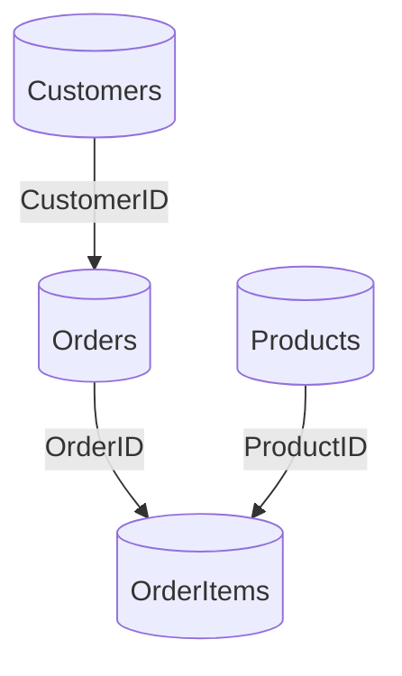

### Example dataset

#### Training grounds (no real dragons, just synthetic ones)
This is your practice arena. Swing at sample SQLs and learn their moves. The JSONs are your coaches—copy their form exactly.

- Path: `examples/warehouse/`
- Warm-ups: base tables, staging views, facts, and aggregates
- Advanced drills: stars, UNIONs, procedures with temp tables

Remember: numbering helps you keep the monsters in order.

Location: `examples/warehouse/`

```
sql/
  01_customers.sql
  02_orders.sql
  03_products.sql
  04_order_items.sql
  10_stg_orders.sql
  11_stg_order_items.sql
  12_stg_customers.sql
  20_vw_recent_orders.sql
  30_dim_customer.sql
  31_dim_product.sql
  40_fct_sales.sql
  41_agg_sales_by_day.sql
  90_usp_refresh_sales_with_temp.sql
  50_vw_orders_all.sql
  51_vw_orders_all_enriched.sql
  52_vw_order_details_star.sql
  53_vw_products_all.sql
  54_vw_recent_orders_star_cte.sql
  55_vw_orders_shipped_or_delivered.sql
  56_vw_orders_union_star.sql
  91_usp_snapshot_recent_orders_star.sql
lineage/
  one JSON per SQL file with OpenLineage column lineage
```

Use these SQL files and the expected JSONs as the supervised “gold” for your agentic loop and regression tests. 

### ER overview


### File-by-file notes (highlights)
- `01_customers.sql`: Base table (DDL) — schema facet only
- `02_orders.sql`: Base table — used in many downstream examples
- `10_stg_orders.sql`: CAST + CASE; introduces boolean-like derivation
- `11_stg_order_items.sql`: arithmetic derived column `ExtendedPrice`
- `20_vw_recent_orders.sql`: CTE with 30-day filter
- `40_fct_sales.sql`: Join stg tables; simple fact grain
- `41_agg_sales_by_day.sql`: Aggregates with GROUP BY and SUM
- `50_*` to `56_*`: star expansion variants, UNION, filters
- `90_*` to `93_*`: procedures with temp tables, SELECT INTO, and variables

### Using the corpus
- Treat JSON files in `lineage/` as gold outputs — your extractor must match them exactly
- Add new cases in numbered order; keep SQL and JSON filenames aligned
- Run regression on changes; failing diffs indicate a behavior change

### Extending the dataset
- Add correlated subqueries, window frames, PIVOT/UNPIVOT, INTERSECT/EXCEPT
- Include negative tests (ambiguous columns, unsupported syntax) to validate warnings 